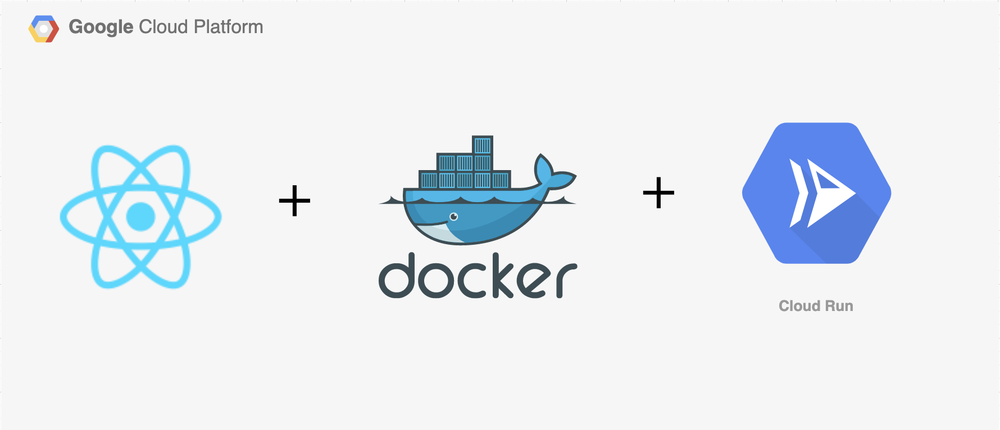

## GCP deployment with React application




Created with *create-react-app*. See the [full create-react-app guide](https://github.com/facebookincubator/create-react-app/blob/master/packages/react-scripts/template/README.md).

### Try it

[application](https://react-app-314311-2tcdwhu7iq-uc.a.run.app/)

### Commands

To start the development server locally

```bash
npm start
```

To create the production ready optimized build

```bash
npm run build
```

To test out the functionality

```bash
npm test
```
  

## Contributors

| Name | GIT ID  | BITS ID |
| --- | --- | --- |
| Roshan Gupta | [#GuptaRoshan](https://github.com/GuptaRoshan) | 2018HS70003 |
| Abhishek Sharma | [#abhish3k-sh](https://github.com/abhish3k-sh) | 2018HS70042 |
| Digvijay Wadkar | [#DigVijayWa](https://github.com/DigVijayWa) | 2018HS70036 |
| Mihir Sagar | [#mihirpsagar](https://github.com/mihirpsagar) | 2018HS70005 |

### Reference

Base application forked from [GitHub - ahfarmer/calculator: Simple calculator built with React](https://github.com/ahfarmer/calculator)
